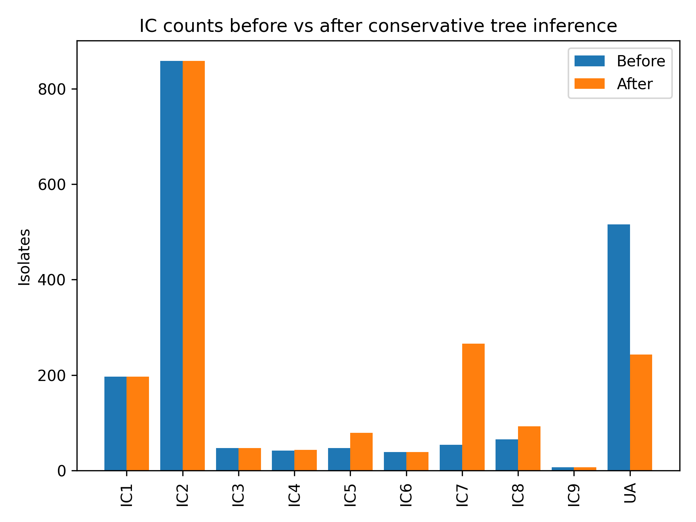
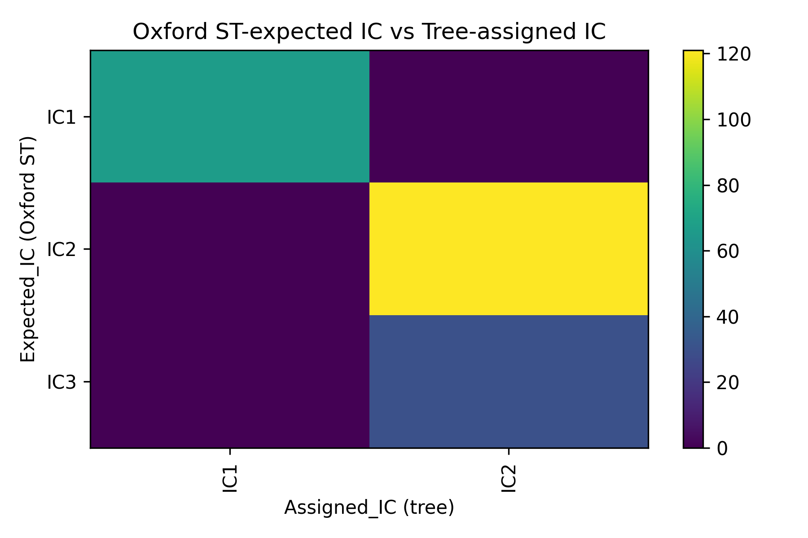
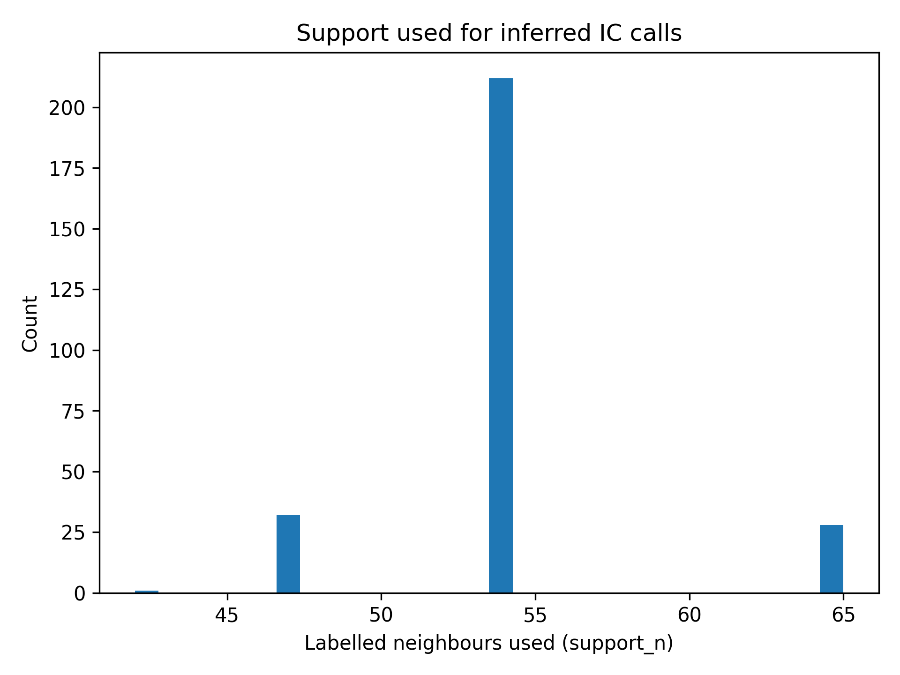

# ICassigner

**ICassigner** is a small, conservative utility for assigning *Acinetobacter baumannii* international clones (ICs) using a core genome phylogeny.

It is designed for situations where:
- ICs are widely used as a shorthand for lineage,
- MLST schemes (Oxford / Pasteur) are not sufficiently resolving,
- cgMLST or whole-genome phylogenies are available, and
- some isolates lack IC designations (`UA`).

The aim is not to force assignments, but to **reduce obvious under-labelling while retaining uncertainty**.

---

## What ICassigner does (and does not do)

**It does:**
- keep all existing IC labels unchanged
- use the core genome tree as the primary lineage definition
- assign ICs only when there is strong local phylogenetic support
- leave ambiguous isolates as `UA` by design
- provide cross-checks against MLST and clustering-based structure

**It does not:**
- redefine international clones
- override expert-curated IC labels
- use MLST to drive assignment
- attempt to classify borderline or recombinant isolates

---

## Requirements

Minimal:
```bash
python -m pip install ete3
```

If you want plots (`--plots`):
```bash
python -m pip install matplotlib numpy
```

---
Inputs
---

### Core genome tree (Newick)

Tips must match sample IDs in metadata:

```text
Acinetobacter-coreML.nwk
```

### Metadata CSV

Must contain:
- a sample ID column (matching tree tips)
- an IC column with known labels or `UA`

Optional but recommended:
- Oxford MLST
- Pasteur MLST
- hBAPS or other clustering assignments

Example:

```csv
sample_id,IC,ST,Country
AB001,IC2,ST2,Russia
AB002,UA,ST78,Ukraine
```

### Basic usage

```bash
python ICassigner.py \
  --tree RAxML-result.Acinetobacter-coreML.nwk \
  --metadata FullMicroreactWyr-with-Russian-Metadata.csv \
  --tip_col "alternative id" \
  --ic_col IC \
  --pasteur_st_col ST_Pasteur \
  --oxford_st_col ST_Oxford \
  --group_cols hBAPS \
  --plots \
  --outdir outputs_icassigner
```

## How IC assignment works

For isolates labelled UA, ICassigner walks up the phylogeny from the tip to the root and identifies the smallest ancestral clade that:
- contains at least 10 isolates with known IC labels, and
- where ≥90% of those labels agree on the same IC.

Only then is an IC assigned.
If these criteria are not met, the isolate remains `UA`.

Both thresholds can be adjusted, but the defaults are intentionally conservative.

---
Outputs
---

Main output table
`metadata_with_conservative_IC_enriched.csv`

Adds the following columns:

| Column                       | Meaning                                      |
| ---------------------------- | -------------------------------------------- |
| `IC_tree_conservative`       | Final IC call (original or inferred)         |
| `IC_tree_support_n`          | Number of labelled neighbours used           |
| `IC_tree_support_prop`       | Proportion supporting assigned IC            |
| `IC_tree_node_size`          | Size of ancestral clade used                 |
| `IC_expected_from_OxfordST`  | IC expected from Oxford MLST (if available)  |
| `IC_expected_from_PasteurST` | IC expected from Pasteur MLST (if available) |

If an isolate remains `UA`, this is by design and indicates genuine phylogenetic ambiguity.

---
Example interpretation of outputs
---

### IC counts before vs after inference


**Fig. 1:** This plot shows that conservative inference:
- substantially reduces UA labels,
- does not inflate dominant clones (e.g. IC2 remains unchanged),
- primarily resolves structured but under-labelled lineages (e.g. IC7).

*Interpretation:* Tree-based IC inference improves resolution without reshaping known population structure.

### Oxford MLST vs tree-assigned IC


**Fig. 2:** Confusion matrices show strong agreement between Oxford ST expectations and tree-assigned ICs for major clones (IC1, IC2), validating the phylogeny-driven approach.

*Interpretation:* Minor discordances reflect known limitations of MLST resolution rather than misassignment.

### hBAPS vs tree-assigned IC


**Fig. 3:** hBAPS clusters show near one-to-one correspondence with inferred ICs, providing independent, unsupervised support for ICassigner assignments.

### Support diagnostics


**Fig. 4:** Histogram showing the proporation of support for each new assignemnt. 



**Fig. 5:** Histograms of number of labelled neighbours used to support assignment.

*Interpretation:* Inferred IC calls are based on deep, well-supported clades rather than marginal local structure.

**Notes on interpretation**

*ICassigner should be viewed as a harmonisation tool, not a lineage discovery method.
Remaining UA isolates should be interpreted as unresolved, not misclassified.*

### Adjusting stringency (optional)

More conservative (publication quality):

```bash
--min_support 15 --min_prop 0.95
```

Slightly more permissive (exploratory analyses):

```bash
--min_support 5 --min_prop 0.8
```

## Suggested citation text (software)

International clone assignment was performed using **ICassigner.py**, a conservative phylogeny-guided IC propagation tool based on majority support within the core genome tree.  

First described in *Pascoe & Mourkas et al.* (in preparation).
